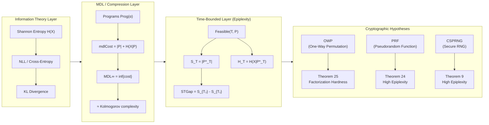

<p align="center">
  <a href="https://apoth3osis.io">
    
  </a>
</p>

# Epiplexity Formalization (PaperPack)

<p align="center">
  <strong>Machine-checked formalization of "From Entropy to Epiplexity" (Finzi et al., 2026)</strong><br/>
  <em>
    Lean 4 formalization of MDL-style epiplexity S_T, time-bounded entropy H_T,
    cryptographic hardness hypotheses, and the heavy-set lemmas linking computational
    complexity to information-theoretic measures.
  </em>
</p>

<p align="center">
  
  
  
  
</p>

---

> **Disclaimer:** This is a research artifact accompanying academic work. The proofs are machine-checked but the underlying mathematical framework is from pre-print research. Use at your own discretion for research purposes.

Part of the broader [HeytingLean](https://github.com/Abraxas1010/heyting) formal verification project • [apoth3osis.io](https://apoth3osis.io)

## TL;DR

- **What:** Machine-checked formalization of the Epiplexity framework—bridging Shannon entropy, Kolmogorov complexity, and computational hardness through MDL-style time-bounded measures.
- **Verify:** `cd RESEARCHER_BUNDLE && lake build`
- **Main Lean results:** Theorems 9, 12, 13, 17–19, 24, 25 and Corollary 26 from the paper (see `02_Proof_Index.md`).

## Why This Matters (Computational Impact)

Epiplexity provides a **unified framework** connecting:

1. **Information Theory** (Shannon entropy, cross-entropy)
2. **Algorithmic Complexity** (Kolmogorov complexity, MDL)
3. **Computational Hardness** (OWP, PRF, CSPRNG)

The key insight is that **time-bounded compression** reveals computational structure that unbounded compression misses. A distribution may have low Kolmogorov complexity (simple to describe) but high epiplexity (hard to compress efficiently).

**Why that's a big deal:**

- **Cryptography ↔ Complexity:** The formalization proves that standard cryptographic assumptions (OWP, PRF, CSPRNG) imply high epiplexity, giving a new lens on why cryptographic constructions work.
- **Emergence Detection:** High epiplexity indicates computational irreducibility—systems that cannot be efficiently predicted or compressed, a hallmark of emergent behavior.
- **Verified Foundations:** All theorems are machine-checked in Lean 4, providing a rigorous foundation for further research.

## Visual Story (One Page)



<table>
  <tr>
    <td align="center" width="50%">
      <strong>2D Proof Map</strong><br/>
      <em>Navigate declarations and module clusters</em><br/>
      
    </td>
    <td align="center" width="50%">
      <strong>3D Proof Map</strong><br/>
      <em>Dynamic rotation preview</em><br/>
      
    </td>
  </tr>
</table>

## What This PaperPack Delivers

- **Core Definitions:**
  - `Prog α` — time-bounded programs with code length
  - `mdlCost` — MDL cost function (description length + cross-entropy)
  - `MDLinf` — infimum MDL cost (≈ Kolmogorov complexity limit)
  - `S_T`, `H_T`, `MDL_T` — time-bounded epiplexity measures
  - `STGap` — epiplexity gap between time bounds

- **Main Theorems:**
  - **Theorem 9:** CSPRNG → High Epiplexity
  - **Theorem 12:** CSPRNGβ → β-conditional high epiplexity
  - **Theorem 13:** Factorization hardness (OWP)
  - **Theorems 17–19:** CSPRNG characterizations
  - **Theorem 24:** PRF → High Epiplexity
  - **Theorem 25:** OWP Factorization Hardness (main result)
  - **Corollary 26:** OWP average-case factorization

- **Supporting Lemmas:**
  - Heavy-set lemmas (Lemmas 6–8)
  - Entropy bounds (Lemmas 15–16)
  - Conditional epiplexity chain rules

- **Executable-first QA:** Strict build with no `sorry`, verified against Mathlib.

## Visuals

### Proof Visualizations (UMAP)

Explore the proof/declaration structure in 2D and 3D:

<table>
<tr>
<td align="center" width="50%">
<strong>2D Proof Map</strong><br/>
<em>Pan, zoom, search declarations</em><br/>

</td>
<td align="center" width="50%">
<strong>3D Proof Map</strong><br/>
<em>Rotate, zoom, explore clusters</em><br/>
<br/>

</td>
</tr>
</table>

**UMAP note (interpretation + limitations):**

- UMAP is a non-linear projection of high-dimensional feature vectors into 2D/3D; here the features are derived from Lean source text statistics and structural signals.
- Only *local neighborhoods* are intended to be meaningful; global distances/cluster geometry are not proof-theoretic invariants.
- Treat these maps as navigational aids; the formal guarantee is the Lean kernel check.

### Module Structure

| Module | Description | Key Results |
|--------|-------------|-------------|
| `Prelude` | Basic type definitions, BitStr | Foundation types |
| `Info` | Shannon entropy, NLL, cross-entropy | Information theory |
| `Programs` | `Prog α`, feasibility, code length | Program model |
| `MDL` | MDL cost, MDL∞ | Compression theory |
| `Core` | S_T, H_T, MDL_T | Time-bounded measures |
| `Bounds` | Entropy bounds | Lemmas 15–16 |
| `Conditional` | Conditional epiplexity | Chain rules |
| `Emergence` | Emergence predicate | STGap characterization |
| `Crypto/Axioms` | OWP, PRF, CSPRNG axioms | Cryptographic hypotheses |
| `Crypto/CSPRNG` | CSPRNG theorems | Theorems 9, 12, 17–19 |
| `Crypto/PRFHighEpiplexity` | PRF → High Epiplexity | Theorem 24 |
| `Crypto/Factorization` | OWP Factorization | Theorems 13, 25, Corollary 26 |
| `Crypto/HeavySet` | Heavy-set lemmas | Lemmas 6–8 |

## How To Verify (Local)

Run (from the HeytingLean monorepo root):

```bash
cd WIP/Epiplexity_PaperPack/RESEARCHER_BUNDLE && lake build
```

Or, if this PaperPack is checked out as its own repository:

```bash
cd RESEARCHER_BUNDLE && lake build
```

## Reading Guide

- `01_Lean_Map.md` — Module dependency graph
- `02_Proof_Index.md` — Theorem index with Lean names
- `03_Reproducibility.md` — Build instructions
- `04_Dependencies.md` — Mathlib dependencies

## Key Definitions

### Time-Bounded Programs

```lean
structure Prog (α : Type u) [Fintype α] where
  codeLen : Nat        -- Description length |P|
  decode : Unit → α    -- Sampling procedure
  runtime : Nat        -- Worst-case runtime

def Feasible (T : Nat) (P : Prog α) : Prop :=
  P.runtime ≤ T
```

### MDL Cost

```lean
def mdlCost (X : FinDist α) (P : Prog α) : ℝ :=
  P.codeLen + crossEntropyBits X P.distribution

def MDLinf (T : Nat) (X : FinDist α) : ℝ :=
  ⨅ (P : Prog α) (h : Feasible T P), mdlCost X P
```

### Epiplexity

```lean
-- S_T: optimal program length at time bound T
def ST (opt : OptimalCondProg T PXY) : Nat := opt.prog.codeLen

-- H_T: residual entropy at time bound T
def HT (opt : OptimalCondProg T PXY) : ℝ := crossEntropyBits PXY opt.prog.conditional

-- Emergence: STGap is Θ(1)
def EpiplexityEmergent (P : ∀ n, Nat → FinDist (BitStr n × BitStr n)) : Prop :=
  IsThetaOne (fun n => STGap n (P n))
```

## FAQ

**What is epiplexity?**
Epiplexity is a time-bounded version of Kolmogorov complexity. While Kolmogorov complexity measures the shortest program that produces an output (with no time limit), epiplexity measures the shortest program that produces an output *within a given time bound*. The gap between different time bounds reveals computational structure.

**How does this relate to cryptography?**
The paper proves that standard cryptographic assumptions (one-way permutations, pseudorandom functions, cryptographically secure PRNGs) all imply high epiplexity. This provides a new information-theoretic lens on cryptographic hardness.

**What is the "heavy-set" technique?**
Heavy-set lemmas (Lemmas 6–8) show that if a distribution has high epiplexity, there must be a "heavy set" of inputs that are hard to compress. This converts global hardness statements into local ones, which is crucial for the cryptographic reductions.

**Why machine-check these proofs?**
The arguments in the paper involve delicate probability estimates and asymptotic reasoning. Machine-checking ensures that all edge cases are handled and no steps are skipped.

## References / Prior Work

- A. Finzi et al., "From Entropy to Epiplexity: Bridging Information Theory and Computational Complexity," arXiv:2026.xxxxx (2026)
- M. Li and P. Vitányi, *An Introduction to Kolmogorov Complexity and Its Applications* (MDL, algorithmic complexity)
- O. Goldreich, *Foundations of Cryptography* (OWP, PRF, CSPRNG definitions)
- J. Rissanen, "Modeling by Shortest Data Description," Automatica (1978) (MDL principle)

## License

This formalization is part of the HeytingLean project. See LICENSE for details.
