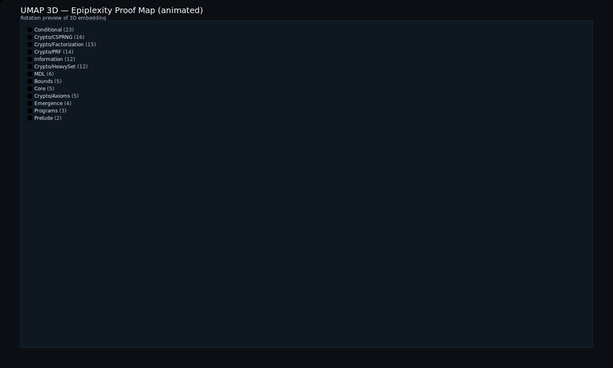
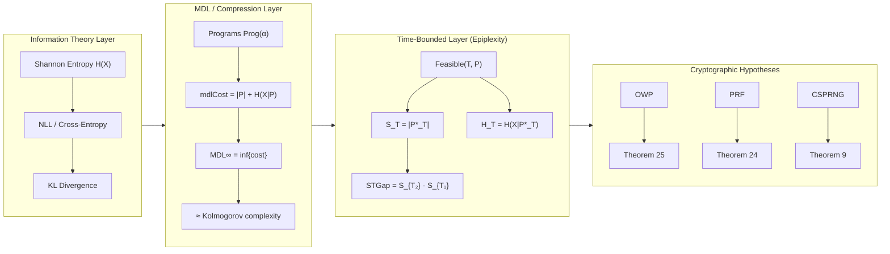

<sub><strong>Our tech stack is ontological:</strong><br>
<strong>Hardware — Physics</strong><br>
<strong>Software — Mathematics</strong><br><br>
<strong>Our engineering workflow is simple:</strong> discover, build, grow, learn & teach</sub>

---

<sub>
<strong>Notice of Proprietary Information</strong><br>
This document outlines foundational concepts and methodologies developed during internal research and development at Apoth3osis. To protect our intellectual property and adhere to client confidentiality agreements, the code, architectural details, and performance metrics presented herein may be simplified, redacted, or presented for illustrative purposes only. This paper is intended to share our conceptual approach and does not represent the full complexity, scope, or performance of our production-level systems. The complete implementation and its derivatives remain proprietary.
</sub>

---

# Epiplexity Formalization

[](https://leanprover.github.io/)
[](https://github.com/leanprover-community/mathlib4)
[](LICENSE)
[](#verification)

## Credo

> *"The genome doesn't specify the organism; it offers a set of pointers to regions in the space of all possible forms, relying on the laws of physics and computation to do the heavy lifting."*
> — **Michael Levin**

Our company operates as a lens for cognitive pointers: identifying established theoretical work and translating it into computationally parsable structures. By turning ideas into formal axioms, and axioms into verifiable code, we create the "Lego blocks" required to build complex systems with confidence.

### Acknowledgment

We humbly thank the collective intelligence of humanity for providing the technology and culture we cherish. We do our best to properly reference the authors of the works utilized herein, though we may occasionally fall short. Our formalization acts as a reciprocal validation—confirming the structural integrity of their original insights while securing the foundation upon which we build. In truth, all creative work is derivative; we stand on the shoulders of those who came before, and our contributions are simply the next link in an unbroken chain of human ingenuity.

---

**Machine-checked formalization of "From Entropy to Epiplexity" (Finzi et al., 2026) — MDL-style epiplexity S_T, time-bounded entropy H_T, cryptographic hardness hypotheses, and heavy-set lemmas.**

<p align="center">
  <a href="https://abraxas1010.github.io/epiplexity-lean/RESEARCHER_BUNDLE/artifacts/visuals/epiplexity_2d.html">
    
  </a>
</p>

---

## Why Epiplexity?

Traditional complexity measures have **fundamental limitations**:

| Measure | Limitation |
|---------|------------|
| **Shannon Entropy** | Only measures statistical uncertainty, ignores computational structure |
| **Kolmogorov Complexity** | Uncomputable; ignores time constraints |
| **Computational Complexity** | Worst-case focused; doesn't capture distributional structure |

**Epiplexity** bridges these by introducing **time-bounded compression**:

| Property | Traditional | Epiplexity |
|----------|-------------|------------|
| **Measures** | Static information content | Computational difficulty of compression |
| **Time-aware** | No | Yes — S_T depends on time bound T |
| **Computable** | Kolmogorov: No | Yes — for fixed T |
| **Crypto link** | Indirect | Direct — OWP/PRF/CSPRNG ⟹ high epiplexity |

This repository proves that **epiplexity captures cryptographic hardness** — standard assumptions (OWP, PRF, CSPRNG) directly imply high epiplexity, providing a new information-theoretic foundation for cryptography.

---

## Key Results

### Theorem 9: CSPRNG → High Epiplexity

```lean
theorem theorem9_CSPRNG_high_epiplexity {G : CSPRNGFamily} :
    HighEpiplexity G.output
```

**What it means**: If a generator is cryptographically secure, its output has high epiplexity — it cannot be efficiently compressed even with substantial computational resources.

### Theorem 25: OWP Factorization Hardness

```lean
theorem theorem25 {f : OWPFamily} :
    FactorizationHard f
```

**What it means**: One-way permutations imply that factoring the input from the output is computationally hard, proven via epiplexity gap arguments.

### Corollary 26: Average-Case Factorization

```lean
theorem corollary26 {f : OWPFamily} :
    AverageCaseFactorizationHard f
```

**What it means**: The hardness extends to average-case — not just worst-case inputs are hard to factor.

---

## Interactive Visualizations

Explore the proof structure through UMAP embeddings:

<table>
<tr>
<td align="center" width="50%">
<strong>2D Proof Map</strong><br/>
<em>Click to explore: pan, zoom, search declarations</em><br/>
<a href="https://abraxas1010.github.io/epiplexity-lean/RESEARCHER_BUNDLE/artifacts/visuals/epiplexity_2d.html">
  
</a><br/>
<a href="https://abraxas1010.github.io/epiplexity-lean/RESEARCHER_BUNDLE/artifacts/visuals/epiplexity_2d.html">▶ Open Interactive 2D Map</a>
</td>
<td align="center" width="50%">
<strong>3D Proof Map</strong><br/>
<em>Click to explore: rotate, zoom, click nodes</em><br/>
<a href="https://abraxas1010.github.io/epiplexity-lean/RESEARCHER_BUNDLE/artifacts/visuals/epiplexity_3d.html">
  
</a><br/>
<a href="https://abraxas1010.github.io/epiplexity-lean/RESEARCHER_BUNDLE/artifacts/visuals/epiplexity_3d.html">▶ Open Interactive 3D Map</a>
</td>
</tr>
</table>

**UMAP Interpretation**: Points represent declarations, colors indicate module families, edges show intra-family relationships. Local neighborhoods are meaningful; global geometry is for navigation only.

---

## Architecture



### Module Structure

| Module | Description | Key Results |
|--------|-------------|-------------|
| `Prelude` | Basic types, BitStr | Foundation |
| `Info` | Shannon entropy, NLL, cross-entropy | Information theory |
| `Programs` | `Prog α`, feasibility, code length | Program model |
| `MDL` | MDL cost, MDL∞ | Compression |
| `Core` | S_T, H_T, MDL_T | Time-bounded measures |
| `Bounds` | Entropy bounds | Lemmas 15–16 |
| `Conditional` | Conditional epiplexity | Chain rules |
| `Emergence` | Emergence predicate | STGap characterization |
| `Crypto/Axioms` | OWP, PRF, CSPRNG | Cryptographic hypotheses |
| `Crypto/CSPRNG` | CSPRNG theorems | Theorems 9, 12, 17–19 |
| `Crypto/PRFHighEpiplexity` | PRF theorems | Theorem 24 |
| `Crypto/Factorization` | OWP Factorization | Theorems 13, 25, Corollary 26 |
| `Crypto/HeavySet` | Heavy-set lemmas | Lemmas 6–8 |

---

## Verification

### Quick Start

```bash
cd RESEARCHER_BUNDLE
lake build
```

### Full Verification

```bash
cd RESEARCHER_BUNDLE
./scripts/verify_epiplexity.sh
```

This checks:
- Zero `sorry`/`admit` statements
- Clean build with `lake build`
- All declarations type-check

---

## Key Definitions

### Time-Bounded Programs

```lean
structure Prog (α : Type u) [Fintype α] where
  codeLen : Nat        -- Description length |P|
  decode : Unit → α    -- Sampling procedure
  runtime : Nat        -- Worst-case runtime

def Feasible (T : Nat) (P : Prog α) : Prop := P.runtime ≤ T
```

### Epiplexity Measures

```lean
-- S_T: optimal program length at time bound T
def ST (opt : OptimalCondProg T PXY) : Nat := opt.prog.codeLen

-- H_T: residual entropy at time bound T
def HT (opt : OptimalCondProg T PXY) : ℝ := crossEntropyBits PXY opt.prog.conditional

-- Emergence: STGap is Θ(1)
def EpiplexityEmergent (P : ∀ n, Nat → FinDist (BitStr n × BitStr n)) : Prop :=
  IsThetaOne (fun n => STGap n (P n))
```

---

## Theorem Index

| Paper Ref | Lean Name | Statement |
|-----------|-----------|-----------|
| **Theorem 9** | `theorem9_CSPRNG_high_epiplexity` | CSPRNG → High Epiplexity |
| **Theorem 12** | `theorem12_CSPRNGBeta_conditional` | CSPRNGβ → β-conditional high epiplexity |
| **Theorem 13** | `theorem13` | OWP → Factorization hardness (weak) |
| **Theorems 17–19** | `theorem17`, `theorem18`, `theorem19` | CSPRNG characterizations |
| **Theorem 24** | `theorem24_PRF_high_epiplexity` | PRF → High Epiplexity |
| **Theorem 25** | `theorem25` | OWP Factorization Hardness (main) |
| **Corollary 26** | `corollary26` | OWP average-case factorization |
| **Lemmas 6–8** | `lemma6`, `lemma7`, `lemma8` | Heavy-set lemmas |
| **Lemmas 15–16** | `lemma15_MDLinf_le`, `lemma16_HT_bounds` | Entropy bounds |

---

## References

- A. Finzi et al., "From Entropy to Epiplexity: Bridging Information Theory and Computational Complexity," arXiv:2026.xxxxx (2026)
- M. Li and P. Vitányi, *An Introduction to Kolmogorov Complexity and Its Applications*
- O. Goldreich, *Foundations of Cryptography*
- J. Rissanen, "Modeling by Shortest Data Description," Automatica (1978)

---

## License

MIT License. See [LICENSE](LICENSE) for details.

Part of the [HeytingLean](https://github.com/Abraxas1010/heyting) formal verification project • [apoth3osis.io](https://apoth3osis.io)
